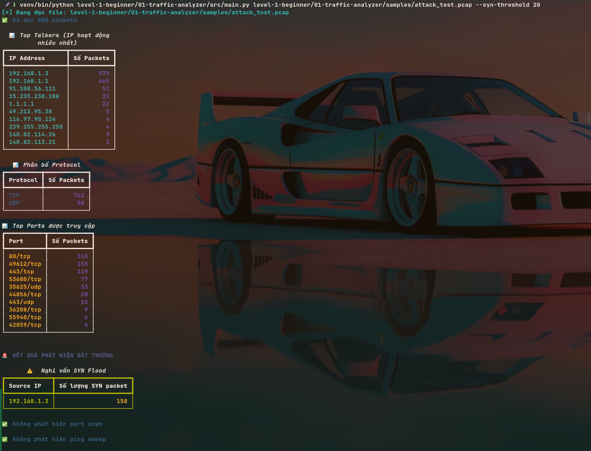
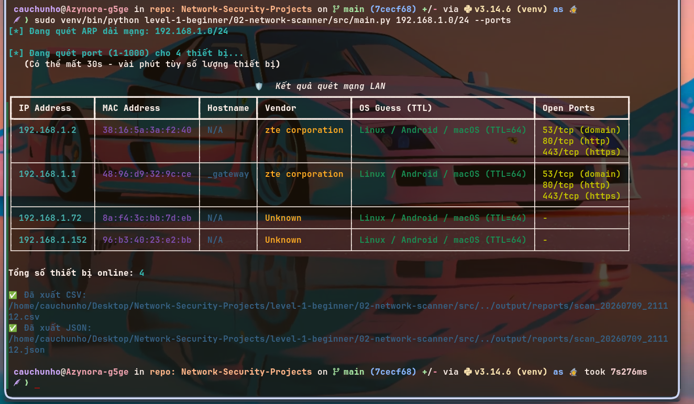
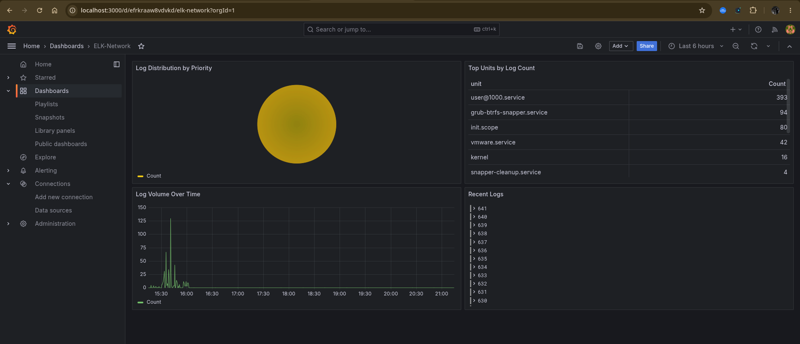

# 🛡️ Network Security Projects

> Hands-on Blue Team / SOC / NOC practice lab built from scratch on Linux
> Phòng lab thực hành Blue Team / SOC / NOC tự xây dựng từ đầu trên Linux

[](https://python.org)
[](https://garudalinux.org)
[](https://docker.com)
[](https://elastic.co)
[](https://grafana.com)
[](LICENSE)

---

## 🎯 About / Về dự án

**EN:** I built this repository to practice **Blue Team / SOC Analyst** skills through real-world projects, written from scratch in Python on a real Linux environment — no pre-built tools, every feature is self-implemented to understand the underlying principles.

**VI:** Tôi xây dựng repo này để thực hành các kỹ năng **Blue Team / SOC Analyst** thông qua các dự án thực tế, viết từ đầu bằng Python trên môi trường Linux thật — không dùng công cụ có sẵn, tự implement từng tính năng để hiểu nguyên lý hoạt động.

**Skills practiced / Kỹ năng thực hành được:**
- Network traffic analysis and attack detection from `.pcap` files / Phân tích network traffic và phát hiện tấn công từ file `.pcap`
- LAN scanning and OS detection via TTL fingerprinting / Quét mạng LAN, nhận diện OS qua TTL fingerprint
- Log collection, parsing, storage, and visualization / Thu thập, parse, lưu trữ và trực quan hóa log hệ thống
- Building a SIEM stack with Elasticsearch + Grafana / Xây dựng SIEM stack với Elasticsearch + Grafana

---

## 🗂️ Projects / Dự án

| # | Project | Description / Mô tả | Stack | Status |
|---|---------|---------------------|-------|--------|
| 01 | [🔍 Traffic Analyzer](level-1-beginner/01-traffic-analyzer/) | `.pcap` analysis, SYN flood / Port scan / Ping sweep detection / Phân tích `.pcap`, phát hiện SYN flood / Port scan / Ping sweep | Python, Scapy, tcpdump | ✅ Done |
| 02 | [📡 Network Scanner](level-1-beginner/02-network-scanner/) | LAN scanning, ARP scan, OS fingerprint via TTL, port scan / Quét LAN, ARP scan, OS fingerprint qua TTL, port scan | Python, Scapy, Nmap | ✅ Done |
| 03 | [📊 Simple SIEM](level-1-beginner/03-simple-siem/) | Log collection, SQLite storage, brute-force detection, Grafana dashboard / Thu thập log, lưu SQLite, phát hiện brute-force, dashboard Grafana | Python, SQLite, Elasticsearch, Grafana, Docker | ✅ Done |
| - | ⭐⭐ Intermediate | *(Coming soon / Sắp ra mắt)* | - | 🔒 |
| - | ⭐⭐⭐ Advanced | *(Coming soon / Sắp ra mắt)* | - | 🔒 |

---

## 🖥️ Demo

### 01 - Traffic Analyzer


### 02 - Network Scanner


### 03 - Simple SIEM Dashboard (Grafana)


---

## ⚙️ Installation / Cài đặt

```bash
# Clone repo
git clone git@github.com:Azynora/Network-Security-Projects.git
cd Network-Security-Projects

# Create virtualenv and install dependencies / Tạo virtualenv và cài dependencies
python -m venv venv
source venv/bin/activate
pip install -r requirements.txt

# Install system tools (Arch/Garuda) / Cài công cụ hệ thống (Arch/Garuda)
sudo pacman -S nmap tshark tcpdump wireshark-qt
```

## 🚀 Quick Start / Chạy nhanh

```bash
# Network Scanner
sudo venv/bin/python level-1-beginner/02-network-scanner/src/main.py 192.168.1.0/24 --ports

# Traffic Analyzer
venv/bin/python level-1-beginner/01-traffic-analyzer/src/main.py path/to/capture.pcap

# Simple SIEM (requires Docker / cần Docker)
cd level-1-beginner/03-simple-siem/docker && docker compose up -d
venv/bin/python level-1-beginner/03-simple-siem/src/main.py collect --minutes 60 --save
venv/bin/python level-1-beginner/03-simple-siem/src/main.py index
venv/bin/python level-1-beginner/03-simple-siem/src/main.py detect
# Grafana dashboard: http://localhost:3000
```

---

<<<<<<< HEAD
## 📁 Cấu trúc
=======
## 📁 Structure / Cấu trúc
>>>>>>> 584cc5e (docs: add bilingual English-Vietnamese README support)

```
Network-Security-Projects/
├── level-1-beginner/
│   ├── 01-traffic-analyzer/
│   │   └── src/
│   │       ├── main.py
│   │       └── analyzer/
│   │           ├── loader.py      # read .pcap / đọc .pcap
│   │           ├── stats.py       # top talkers/ports/protocols
│   │           ├── detection.py   # SYN flood, port scan, ping sweep
│   │           └── display.py     # rich table output
│   ├── 02-network-scanner/
│   │   └── src/
│   │       ├── main.py
│   │       └── scanner/
│   │           ├── arp.py         # ARP scan
│   │           ├── fingerprint.py # OS detect via TTL
│   │           ├── ports.py       # nmap port scan
│   │           ├── lookup.py      # hostname + MAC vendor
│   │           ├── display.py     # rich table output
│   │           └── exporter.py    # CSV/JSON export
│   └── 03-simple-siem/
│       ├── src/
│       │   ├── main.py
│       │   └── siem/
│       │       ├── journal_reader.py  # journalctl collector
│       │       ├── storage.py         # SQLite
│       │       ├── detection.py       # brute-force detection
│       │       ├── display.py         # rich output
│       │       └── es_indexer.py      # Elasticsearch indexer
│       └── docker/
│           └── docker-compose.yml     # ES + Grafana stack
├── requirements.txt
└── resources/
```
<<<<<<< HEAD
=======

>>>>>>> 584cc5e (docs: add bilingual English-Vietnamese README support)
---

## ⚠️ Disclaimer / Tuyên bố miễn trừ

**EN:** The tools in this repository are **for educational purposes only** in lab environments or authorized networks. Any use on systems you do not own is strictly prohibited.

**VI:** Các công cụ trong repo này **chỉ dùng cho mục đích học tập** trong môi trường lab hoặc mạng được cấp phép. Nghiêm cấm sử dụng trên hệ thống không thuộc quyền sở hữu.